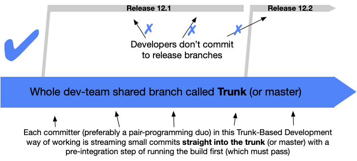

# Contributing

## Development Flow

We use [Trunk-based development](https://trunkbaseddevelopment.com/).

A source-control branching model, where developers collaborate on code in a single branch called *trunk*, resist any pressure to create other long-lived development branches by employing documented techniques.
They therefore avoid merge hell, do not break the build, and live happily ever after.

### Trunk-Based Development For Smaller Teams


### Example

```mermaid
%%{init: { 'logLevel': 'debug', 'theme': 'base' } }%%
gitGraph
    commit
    branch release-1.12
    checkout release-1.12
    commit
    merge main tag: "1.12.0"
    checkout main
    commit id: "bug fix"
    commit
    branch feat/cypher-1
    branch feat/cypher-2
    branch feat/cypher-3
    checkout feat/cypher-1
    commit id: "feat: added entity"
    commit id: "feat: added business logic"
    checkout main
    merge feat/cypher-1
    checkout feat/cypher-3
    commit
    checkout feat/cypher-2
    commit
    merge feat/cypher-3
    checkout main
    merge feat/cypher-2
    checkout release-1.12
    merge main tag: "1.12.1"
    commit tag: "1.12.2"
    checkout main
    commit
    commit
    branch release-2.0
    commit tag: "2.0.0"
    checkout main
    commit
```

## Coding Style

### Names

#### Chialisp

- Use `kebab-case` for function names.
- Use `snake_case` for function variable names.
- Use `--private-function` for prefixing functions intended to be private. (Note: They are not in fact private, just requested to be)
- Use `%inline-function` for prefixing functions that encapsulates implementation in `defun-inline`.
- Use `normal-function` with no prefixing that encapsulates implementation in `defun`.
- Use `@macro-function` for prefixing macros.

#### Cypher-specific

- Use `PascalCase` for class names. (Note: there are no actual classes in chialisp, and only pseudo-classes as defined in the scope of this project.)
- Use `module.submodule.MyCoolClass.function-name` pattern for hierarchical naming.
- Export all symbols with `cf.` name space, except for condition codes.

## Commit Signature

Using GPG, SSH, or S/MIME, you can sign tags and commits locally. These tags or commits are marked as verified on GitHub so other people can be confident that the changes come from a trusted source.


[How to setup commit signature](https://docs.github.com/en/authentication/managing-commit-signature-verification/about-commit-signature-verification)

## Commit Message

### Commit Message Format

Each commit message consists of a **header**, a **body** and a **footer**. The header has a special
format that includes a **type**, a **scope** and a **subject**:

```
<type>(<scope>): <subject>
<BLANK LINE>
<body>
<BLANK LINE>
<footer>
```

The **header** is mandatory and the **scope** of the header is optional.

Example — `fix: remove unused dependency lodash.camelcase`

Any line of the commit message cannot be longer 100 characters. This allows the message to be easier to read on GitHub
as well as in various git tools.

#### Type

Must be one of the following:

* **feat**: A new feature.
* **fix**: A bug fix.
* **docs**: Documentation only changes.
* **style**: Changes that do not affect the meaning of the code (white-space, formatting, missing semi-colons, etc).
* **refactor**: A code change that neither fixes a bug nor adds a feature.
* **perf**: A code change that improves performance.
* **test**: Adding missing tests.
* **build**: Changes that affect the build system or external dependencies (example scopes: gulp, broccoli, npm)
* **ci**: Changes to our CI configuration files and scripts (example scopes: Travis, Circle, BrowserStack, SauceLabs)
* **chore**: Changes to the build process or auxiliary tools and libraries such as documentation generation.
* **revert**: Reverts a previous commit

#### Scope

The scope is optional and could be anything specifying place of the commit change. For example `nsis`, `mac`, `linux`,
etc...

#### Subject

The subject contains succinct description of the change:

* use the imperative, present tense: `change` not `changed` nor `changes`,
* don't capitalize first letter,
* no dot (.) at the end.

#### Body

Just as in the **subject**, use the imperative, present tense: "change" not "changed" nor "changes".
The body should include the motivation for the change and contrast this with previous behavior.

#### Footer

The footer should contain any information about **Breaking Changes** and is also the place to reference GitHub issues
that this commit **Closes**.
